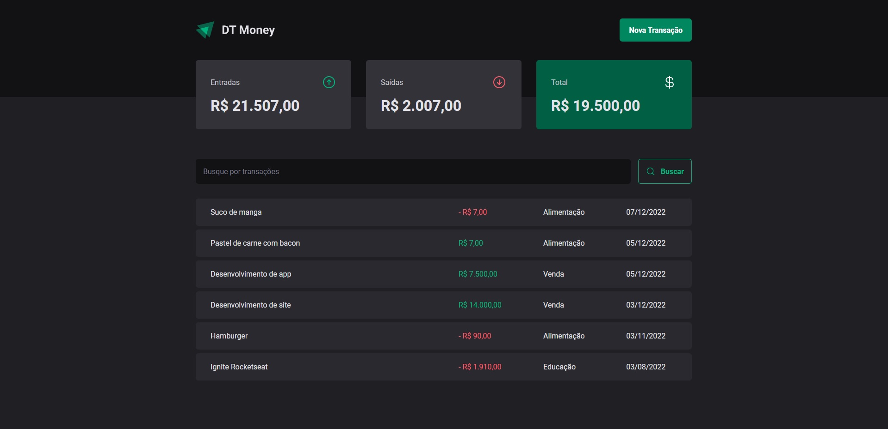

# DT Money - Know where you spend your money 💵

<br><br>

<p align="center">
  <a href="#-about-the-project">About the project</a> •
  <a href="#-technologies">Technologies</a> •
  <a href="#-getting-started">Getting started</a> •
  <a href="#-license">License</a>
</p>

<p align="center">
 
 
  
</p>

## 👩‍💻 About the project

Personal Finance Expenses Control Application, with a balancing system, creation of new transactions, filtering system, etc.

Project built during [Rocketseat](https://rocketseat.com.br/) ReactJS course, Where the objective was the consumption of an API and the improvement of performance in ReactJS.

[click here, see closer](https://dt-money-2-0-cs.vercel.app/) 😉

<b>Note</b>: The application uses a Fake Online REST server, in API error situations, run the local server, `npm run dev-server `

## 🔖 Layout

You can view the project layout through the links below:

- [Layout in Figma](<https://www.figma.com/file/K9T7dhdV8cqj5cr3xqHjyr/DT-Money-(Community)?node-id=0%3A1&t=Ic2Cl4RH2ULtm5bS-0>)

> Remembering that you need to have a [Figma](http://figma.com/) account to access it.

## 🚀 Technologies

- [ReactJs](https://reactjs.org/)
- [Styled Components](https://styled-components.com/)
- [useForm](https://react-hook-form.com/api/useform/)
- [zod](https://zod.dev/)
- [React Router](https://reactrouter.com/en/main)
- [json-server](https://github.com/typicode/json-server)
- [axios](https://axios-http.com/ptbr/docs/intro)

## 💻 Getting started

### Requirements

- [Node.js](https://nodejs.org/en/)
- [Yarn](https://classic.yarnpkg.com/) or [NPM](https://www.npmjs.com/) _(examples are with yarn)_

**Clone the project and access the folder**

```bash
$ git clone https://github.com/leandrorodrigues00/dt-money-2.0/ && cd dt-money-2.0
```

**Follow the steps below**

```bash
# Install the dependencies
$ yarn

# Make a copy of '.env.example' to '.env'
# and set with YOUR environment variables.
$ cp .env.example .env

# Start the app
$ yarn dev
```

## 📝 License

This project is licensed under the MIT License - see the [LICENSE](LICENSE) file for details.

---

<p align="center">
  Made with 💜&nbsp; by  Leandro Rodrigues
</p>
